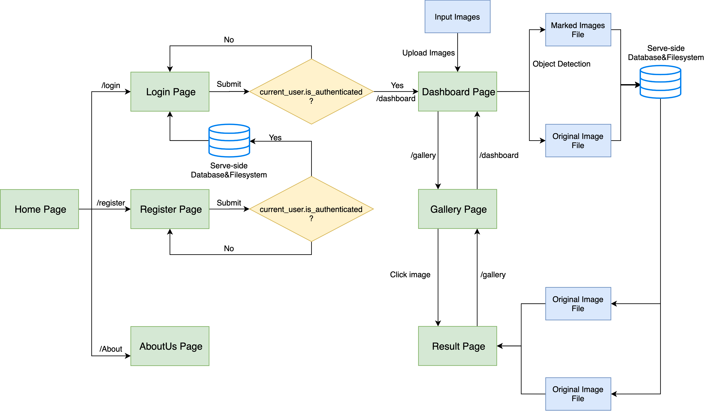
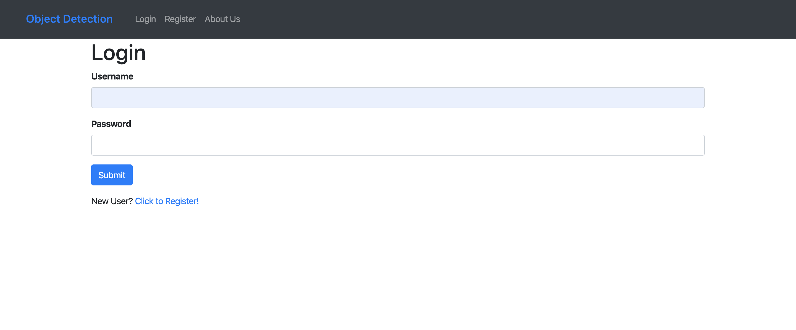
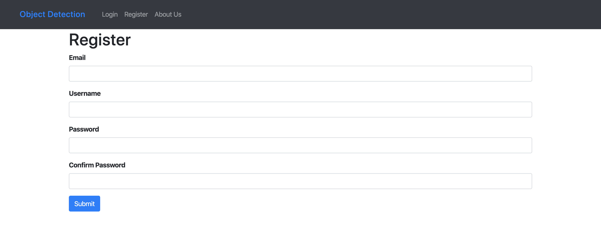
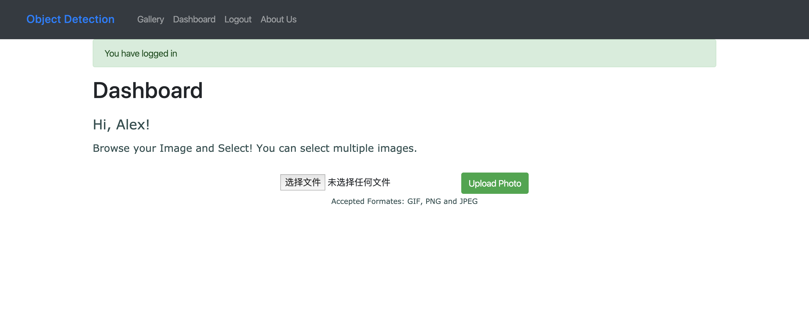
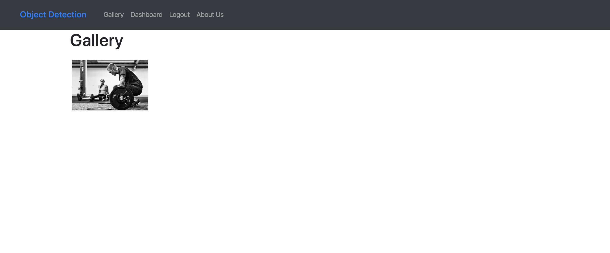
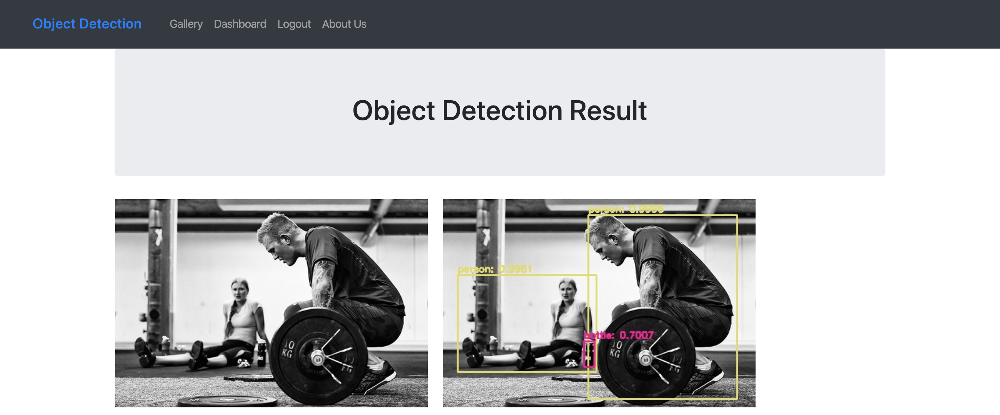

# Image Object Detection Web Application

Group project from course "Cloud Computing". This cloud-based web application is hosted on AWS EC2 instance with the ablility to conduct object detection using OpenCV and YOLO on user uploaded images. The users can sign up for an account on the website and upload images onto the server for processing. The users can also browse their uploaded images together with the processed results.

<table>
 <tr>
    <td></td>
 </tr>
 <tr>
    <td></td>
 </tr>
 <tr>
    <td></td>
 </tr>
 <tr>
    <td></td>
 </tr>
 <tr>
    <td></td>
 </tr>
 <tr>
    <td></td>
 </tr>
</table>

